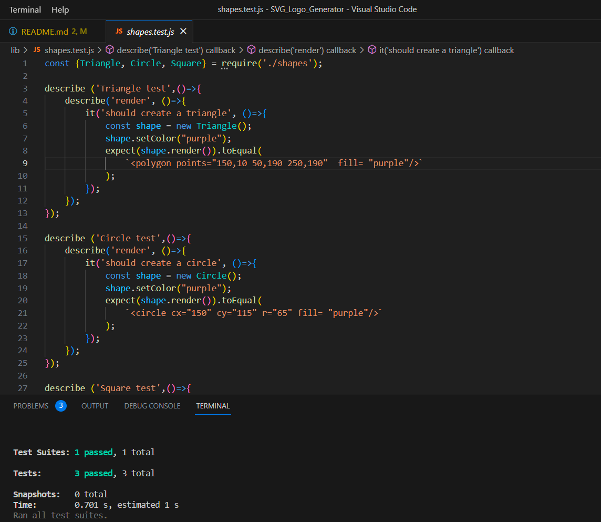
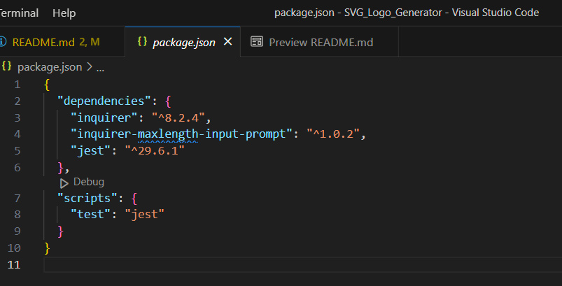

# SVG Logo Generator

## Description

  The goal of this project was to make a simple CLI application to generate a SVG file for a company logo.

## Table of Contents
  
* [Installation](#installation)
* [Usage](#usage)
* [Credits](#credits)
* [License](#license)
* [Contributing](#contributing)
* [Tests](#tests)
* [Questions](#questions)

## [Installation](#table-of-contents)

  Please be sure to run  `npm install` to install the dependencies needed. This project was created using inquirer version 8.2.4, so you may need to install that version (`npm install inquirer@8.2.4.`). An additional add-on was used for the text limiter,

## [Usage](#table-of-contents)
  
  In the command line, run `node index.js` to invoke the inquirer prompts. After answering all questions provided, a logo.svg file will be created with the chosen text, text color, shape and shape color.

## [Credits](#table-of-contents)
  
  https://github.com/jwarby/inquirer-maxlength-input-prompt - for the text limiter feature used.

  https://github.com/octofoxx/SVG_Logo_Generator - repo for this project.

## [License](#table-of-contents)
  
  The application is covered under the following license:
  
  [ISC](https://opensource.org/licenses/ISC)  

## [Contributing](#table-of-contents)
  
  Please use one of the provided links to contact me about contributing.

## [Tests](#table-of-contents)

  Provided is a screenshot that shows testing suite file and the 3 passed tests in the CLI.
  
  

  To run the tests yourself, you will need to make sure you have jest installed (run `install jest` in your terminal) and have the script added to your package.json file (see 2nd screenshot.)

  

## [Questions](#table-of-contents)

  For any questions, please contact via:
  
  [GitHub](https://github.com/octofoxx)

  or:
  
  [Email: devilmaycry87x@gmail.com](mailto:devilmaycry87x@gmail.com)  
